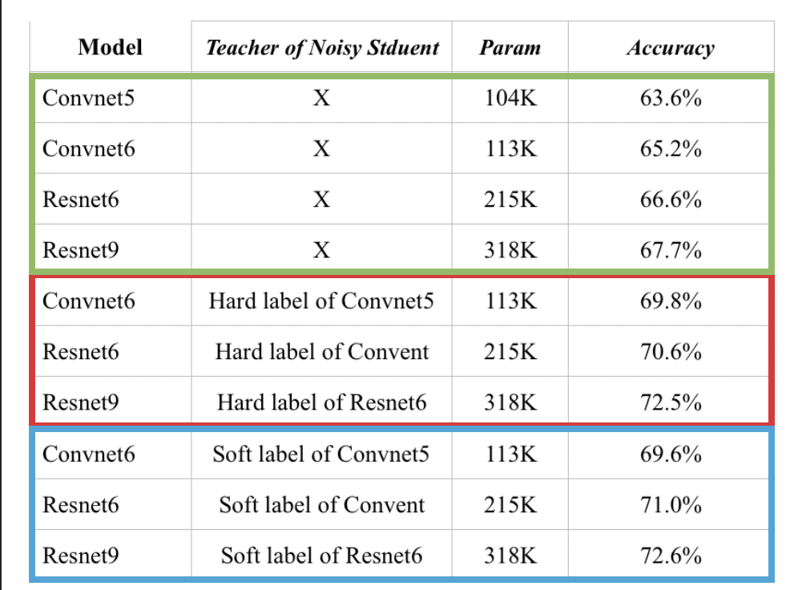
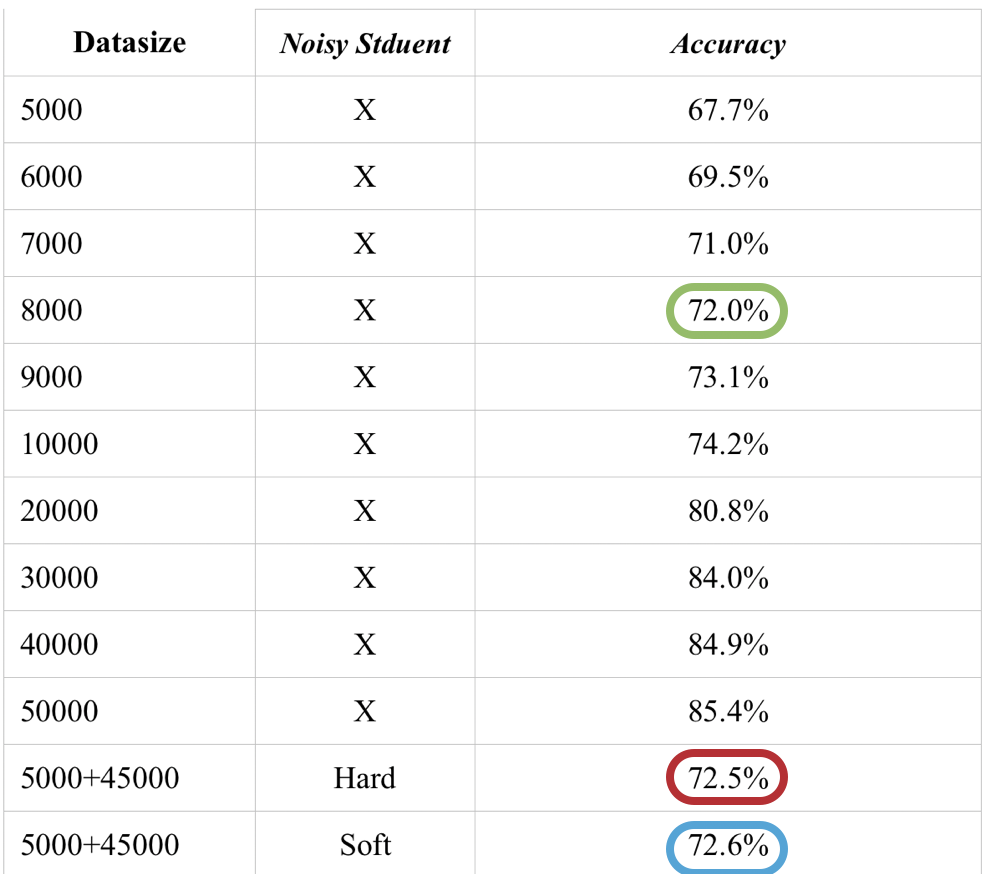

# Noisy Student

2019_2 인공지능 응용 Term project


## Introduction
11월 11일 Google Research Brain Team이 ImageNet 의 SOTA인 Fixing the train-test resolution discrepancy을 넘고 TOP-1 error 에서 1%정도의 격차로 새로운 기록 새웠습니다. SOTA가 자주 바뀌는 현재 ImageNet 에서 새로운 기록을 새운것은 큰 의미가 없어 보였습니다. 하지만 labeled 데이터로 pretraining을 한 것들과 달리 unlabeled 데이터와 ImageNet 데이터만으로 1위를 기록한 것은 의미있는 결과입니다. Training 방법의 아이디어 또한 단순하면서 실제 Teacher-Student의 관계로 부터 inspired 되었다는 점에서도 흥미롭습니다. 

## Method
Noisy student는 현실에서 볼 수 있는 teacher-student 관계를 기반으로 합니다. 단계는 크게 네단계로 나눌 수 있습니다. 
1) Teacher model을 labeled data로 학습합니다.
2) Teacher model로 unlabeled data의 label를 예측합니다. (pseudo labels)
3) Student model로 labeled data와 unlabeled data를 학습합니다.
4) 학습이 끝난 student modeld은 teacher model이 되고 새로운 student model으로 2, 3 을 반복합니다.

먼저 teacher model이 될 모델을 labeled data로 학습합니다. 이때 모델에 noisy를 줌으로써 큰 regularization 효과를 얻습니다. 학습이 끝나면 teacher model로 unlabeled data의 logit을 예측합니다. 이때는 높은 accuracy를 위해 noisy를 사용하지 않습니다. 이렇게 생성된 logit은 pseudo label이라고 하며 argmax를 하기 전상태(soft)로 사용하기도 하고 argmax를 하여(hard) 사용하기도 합니다. Labeled data, unlabeled data + pseudo labels를 이용하여 student 모델을 학습합니다. 이때 labeled data와 unlabeled data에 가중치는 두지 않고 동등하게 취급합니다. 이렇게 학습된 student는 teacher가 되어 위를 반복합니다.
이 방법이 효과를 보기위해선 몇가지 조건이 있습니다. 첫번째는 noisy입니다. Noisy student에서는 Dropout, stochastic depth, RandAugmentation을 이용하여 model을 학습할 때 noisy를 줍니다. 이들은 regularization효과를 주며 다른 input들에 대해 robust하게 학습합니다.
두번째는 student model이 더 많은 데이터를 수용할 수 있는지의 여부입니다. 이는 teacher model의 성능을 얻음과 동시에 labeled data로부터 teacher model보다 더 높은 성능을 얻기 위해선 이를 수용하기에 충분히 커야합니다. 최근 teacher-student 관계를 이용해 이미 학습되어 있는 모델을 distillation 하는 연구들이 있었습니다. 이들은 teacher 모델보다 더 작은 크기의 model를 이용한 반면 noisy student는teacher model보다 성능을 더 높이는것이 목적이기 때문에 더 큰 모델을 사용합니다.

## Experiment
빠른실험을 위해 32x32의 resolution을 가진 cifar10을 사용하였습니다. 이 데이터셋은 50000개의 training data와 10000개의 test data로 구성되어 있습니다. 이를 5000개의 labeled data 와 45000개의 unlabeled data로 나누었습니다. 이는 Noisy student 논문에서 사용한 labeled data로 사용한 ImageNe이 14M개인 것과 unlabeled data로 사용된 구글 내부 데이터중 130M개를 사용했음을 고려해 9배정도 차이나도록 분배하였습니다.
실험을 처음 계획했을때는 Resnet이나 Vgg를 사용하려고 하였습니다. 하지만 이 모델들은  labeded data가 5000개밖에 되지 않아 모델의 크기가 커질수록 accuracy가 낮아지는 문제가 생겼습니다. 따라서 적은 수의 layer들을 쌓아 여러 모델들을 학습시켜보며 4개의 모델을 선택했습니다. 이들은 5000개의 데이터로 학습하였을 때 모델이 커질수록 1~2% 정도의 accuracy 향상이 있습니다. 몇층의 convolution layer들과 1층의 feedforwad로 구성된 Convnet5, Convnet6 그리고 skip connectiond을 추가한 Resnet6, Resnet9 입니다. 가장 작은 Convnet5는 10만개의 파라미터를 가장 큰 Resnet9은 30만개의 파라미터를 가지며 모두 요즘 자주 사용되는 모델들에 비해 굉장히 작은 모델입니다.  

학습에 noisy로 사용되는 Rand Augment는 2개의 파라미터가 있습니다. 하나는 14개의 augment 방법들 중 몇가지를 선택할지를, 다른 하나는 augment 강도(1~10)의 upper bound 를 결정합니다. 다른 auto augmentation에 비하면 search space(14x10)가 굉장히 작지만 결국 여러번에 거쳐 파라미터 탐색을 해야했습니다. Grid search로 5000개의 데이터에 대해 최적의 파라미터를 찾았습니다. 모델의 크기가 변하거나 데이터가 달라지면 이에 적합한 Rand Augment 파라미터도 변할 수 있지만 시간과 resource 관계상 모든 실험에서 같은 파라미터를 사용하였습니다.

## Result



먼저 RandAugmentation의 파라미터를 grid-serach로 찾았습니다. 시간과 리소스의 부족으로 가장 작은 Convnet5와 가장 큰 Resnet9에 대해 5000개의 data만으로 진행하였습니다. 그결과 RandAugmentation 두개의 파라미터가 (5, 10) 일 때 두 모델 Convnet5와 Resnet9 이 가장 높은 성능을 냈습니다. 따라서 이후 모든 학습에서 데이터의 양과 모델에 관계없이 (5, 10)을 적용하였습니다.

RandAugmentation의 파라미터를 찾은 후 4개의 모델에 대해 noisy-student을 사용하지 않고 학습을 하였습니다. noisy-student사용하진 않았지만 noisy로 사용한 dropout과 auto-augmentation을 사용하였을 때 없을때와 비교하여 6~7%의 성능 향상이 있어 이를 적용하였습니다. RandAugmentation은 위에서 찾은 (5, 10)을 그대로 사용하였습니다. Convnet5는 63.6%의 accuracy를 보였고 모델이 커질수록 1~2%의 accuracy의 상승이 있었습니다. 이를 baseline으로 하여 noisy-student를 사용하였을때의 성능 향상을 관찰하였습니다.

가장 작은 모델인 Convnet5는 labeled data에 대해서만 학습하였습니다. 이후 noisy-student 방법으로 Convnet6는 Convnet5를, Resnet6는 Convnet6를, Resnet9은 Resnet6를 teacher로 하여 labeled data와 teacher model로 부터 생성한 pseudo label+unlabeled data에 대해 학습하였습니다. 학습결과 noisy-student를 사용한 것이 사용하지 않은 것보다 4~4.8%의 accuracy 향상이 있었습니다. 

원논문에서는 teacher model의 accuracy가 높으면 soft pseudo label을 사용하든 hard pseudo label를 사용하든 큰차이는 없었다고 합니다. 하지만 accuracy가 낮은 경우 soft pseudo label를 사용하는것이 더 높은 선능을 보여준다고 합니다. 실험 결과 Soft pseudo label을 사용하였을 때와 hard pseudo label를 사용하였을 때의 accuracy차이는 거의 없었습니다.

Labeled data의 크기에 따른 성능과 비교하였을때 noisy student는 labeled data 8000개를 사용했을때보다 accuracy 가 높았지만 9000개를 사용했을때보단 성능이 낮았습니다. 

## 실행

1. Python이 이미 있고 cuda를 지원하는 gpu와 cuda가 설치되어있으면 python package 설치

```
pip install -r requirements.txt
```

2. data_split.ipynb를 jupyter에서 실행시켜 데이터 다운 및 split

3. run.ipynb롤 실험

## Code
run.ipynb 파일에서 4가지 작업을 합니다.

1. RandAugment의 파라미터를 search

2. 4가지 모델의 baseline 성능

3. Noisy-Student 실행

4. 가장 큰모델인 Resnet9을 데이터 양에 따른 accuracy 측정